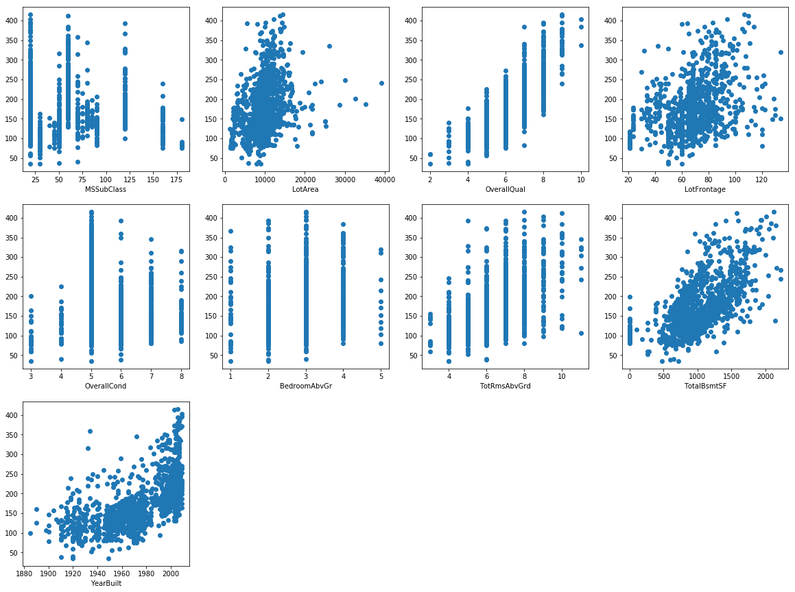
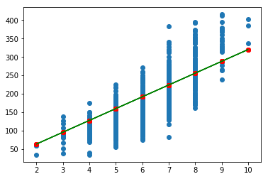
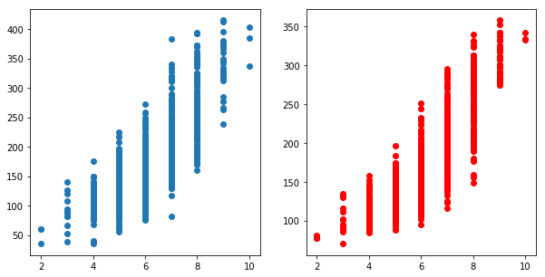

# Computer Assignment 0
Farzad Habibi - 
__810195383__


## Introduction 
Goal of this project is getting more familiar with python libraries for data science. They including `numpy`, `pandas`, and etc.
At the end of this project we got familiar with a simple Linear Regression. 


## A. Loading Data and Get Familier with it
For loading data we use pandas built in `read_csv` function to load a csv file into a data frame. Data frame is a pandas data structure which is like table. It includes some rows with some columns. These rows and columns can also have indexes. 


```python
import pandas as pd
import os
```

In above code block we import pandas with `pd` name. This name is more easier to call, because we want to use it a lot!


```python
TRAIN_SET_DIRECTORY  = '.'
TRAIN_SET_NAME = 'houses.csv'
train_set = pd.read_csv(os.path.join(TRAIN_SET_DIRECTORY, TRAIN_SET_NAME),
                        index_col='Id')
```

After loading `df` we can show some head of datas with `head` method. This method also can get number of row to show as attribute.


```python
train_set.head(n=5)
```


<div>
<style scoped>
    .dataframe tbody tr th:only-of-type {
        vertical-align: middle;
    }

    .dataframe tbody tr th {
        vertical-align: top;
    }

    .dataframe thead th {
        text-align: right;
    }
</style>
<table border="1" class="dataframe">
  <thead>
    <tr style="text-align: right;">
      <th></th>
      <th>MSSubClass</th>
      <th>LotArea</th>
      <th>LotConfig</th>
      <th>OverallQual</th>
      <th>LotFrontage</th>
      <th>Neighborhood</th>
      <th>OverallCond</th>
      <th>BedroomAbvGr</th>
      <th>TotRmsAbvGrd</th>
      <th>TotalBsmtSF</th>
      <th>YearBuilt</th>
      <th>SalePrice</th>
    </tr>
    <tr>
      <th>Id</th>
      <th></th>
      <th></th>
      <th></th>
      <th></th>
      <th></th>
      <th></th>
      <th></th>
      <th></th>
      <th></th>
      <th></th>
      <th></th>
      <th></th>
    </tr>
  </thead>
  <tbody>
    <tr>
      <th>1</th>
      <td>60</td>
      <td>8450</td>
      <td>Inside</td>
      <td>7</td>
      <td>65.0</td>
      <td>CollgCr</td>
      <td>5</td>
      <td>3</td>
      <td>8</td>
      <td>856</td>
      <td>2003</td>
      <td>208.5</td>
    </tr>
    <tr>
      <th>2</th>
      <td>20</td>
      <td>9600</td>
      <td>FR2</td>
      <td>6</td>
      <td>80.0</td>
      <td>Veenker</td>
      <td>8</td>
      <td>3</td>
      <td>6</td>
      <td>1262</td>
      <td>1976</td>
      <td>181.5</td>
    </tr>
    <tr>
      <th>3</th>
      <td>60</td>
      <td>11250</td>
      <td>Inside</td>
      <td>7</td>
      <td>68.0</td>
      <td>CollgCr</td>
      <td>5</td>
      <td>3</td>
      <td>6</td>
      <td>920</td>
      <td>2001</td>
      <td>223.5</td>
    </tr>
    <tr>
      <th>4</th>
      <td>70</td>
      <td>9550</td>
      <td>Corner</td>
      <td>7</td>
      <td>60.0</td>
      <td>Crawfor</td>
      <td>5</td>
      <td>3</td>
      <td>7</td>
      <td>756</td>
      <td>1915</td>
      <td>140.0</td>
    </tr>
    <tr>
      <th>5</th>
      <td>60</td>
      <td>14260</td>
      <td>FR2</td>
      <td>8</td>
      <td>84.0</td>
      <td>NoRidge</td>
      <td>5</td>
      <td>4</td>
      <td>9</td>
      <td>1145</td>
      <td>2000</td>
      <td>250.0</td>
    </tr>
  </tbody>
</table>
</div>


We can also see our `df` informations with `describe` method. This method show some useful information like `count`, `mean`, `min`, `std` (sample standard devation), and etc for every column in data frame.


```python
train_set.describe()
```


<div>
<style scoped>
    .dataframe tbody tr th:only-of-type {
        vertical-align: middle;
    }

    .dataframe tbody tr th {
        vertical-align: top;
    }

    .dataframe thead th {
        text-align: right;
    }
</style>
<table border="1" class="dataframe">
  <thead>
    <tr style="text-align: right;">
      <th></th>
      <th>MSSubClass</th>
      <th>LotArea</th>
      <th>OverallQual</th>
      <th>LotFrontage</th>
      <th>OverallCond</th>
      <th>BedroomAbvGr</th>
      <th>TotRmsAbvGrd</th>
      <th>TotalBsmtSF</th>
      <th>YearBuilt</th>
      <th>SalePrice</th>
    </tr>
  </thead>
  <tbody>
    <tr>
      <th>count</th>
      <td>1134.000000</td>
      <td>1134.000000</td>
      <td>1134.000000</td>
      <td>937.00000</td>
      <td>1134.000000</td>
      <td>1134.000000</td>
      <td>1134.000000</td>
      <td>1134.000000</td>
      <td>1134.000000</td>
      <td>1134.000000</td>
    </tr>
    <tr>
      <th>mean</th>
      <td>54.056437</td>
      <td>9487.280423</td>
      <td>6.065256</td>
      <td>68.40555</td>
      <td>5.551146</td>
      <td>2.828924</td>
      <td>6.354497</td>
      <td>1032.037037</td>
      <td>1972.981481</td>
      <td>174.783949</td>
    </tr>
    <tr>
      <th>std</th>
      <td>38.760477</td>
      <td>3866.279692</td>
      <td>1.294012</td>
      <td>20.13204</td>
      <td>1.015560</td>
      <td>0.734241</td>
      <td>1.441257</td>
      <td>385.301916</td>
      <td>28.432646</td>
      <td>65.428985</td>
    </tr>
    <tr>
      <th>min</th>
      <td>20.000000</td>
      <td>1300.000000</td>
      <td>2.000000</td>
      <td>21.00000</td>
      <td>3.000000</td>
      <td>1.000000</td>
      <td>3.000000</td>
      <td>0.000000</td>
      <td>1885.000000</td>
      <td>34.900000</td>
    </tr>
    <tr>
      <th>25%</th>
      <td>20.000000</td>
      <td>7508.750000</td>
      <td>5.000000</td>
      <td>59.00000</td>
      <td>5.000000</td>
      <td>2.000000</td>
      <td>5.000000</td>
      <td>796.000000</td>
      <td>1955.000000</td>
      <td>129.925000</td>
    </tr>
    <tr>
      <th>50%</th>
      <td>50.000000</td>
      <td>9246.500000</td>
      <td>6.000000</td>
      <td>70.00000</td>
      <td>5.000000</td>
      <td>3.000000</td>
      <td>6.000000</td>
      <td>990.000000</td>
      <td>1975.000000</td>
      <td>161.875000</td>
    </tr>
    <tr>
      <th>75%</th>
      <td>60.000000</td>
      <td>11250.000000</td>
      <td>7.000000</td>
      <td>80.00000</td>
      <td>6.000000</td>
      <td>3.000000</td>
      <td>7.000000</td>
      <td>1262.000000</td>
      <td>2001.000000</td>
      <td>207.500000</td>
    </tr>
    <tr>
      <th>max</th>
      <td>180.000000</td>
      <td>39104.000000</td>
      <td>10.000000</td>
      <td>134.00000</td>
      <td>8.000000</td>
      <td>5.000000</td>
      <td>11.000000</td>
      <td>2223.000000</td>
      <td>2009.000000</td>
      <td>415.298000</td>
    </tr>
  </tbody>
</table>
</div>


```python
train_set.info()
```

    <class 'pandas.core.frame.DataFrame'>
    Int64Index: 1134 entries, 1 to 1243
    Data columns (total 12 columns):
    MSSubClass      1134 non-null int64
    LotArea         1134 non-null int64
    LotConfig       1134 non-null object
    OverallQual     1134 non-null int64
    LotFrontage     937 non-null float64
    Neighborhood    1134 non-null object
    OverallCond     1134 non-null int64
    BedroomAbvGr    1134 non-null int64
    TotRmsAbvGrd    1134 non-null int64
    TotalBsmtSF     1134 non-null int64
    YearBuilt       1134 non-null int64
    SalePrice       1134 non-null float64
    dtypes: float64(2), int64(8), object(2)
    memory usage: 115.2+ KB


### Droping Categorical Features
In this project we should not use categorical columns and it is more easeir to use just number columns; therefore, we will **drop** categorical columns. 


```python
train_set.drop(train_set.select_dtypes(['object']).columns, inplace=True, axis=1)
```


```python
train_set.info()
```

    <class 'pandas.core.frame.DataFrame'>
    Int64Index: 1134 entries, 1 to 1243
    Data columns (total 10 columns):
    MSSubClass      1134 non-null int64
    LotArea         1134 non-null int64
    OverallQual     1134 non-null int64
    LotFrontage     937 non-null float64
    OverallCond     1134 non-null int64
    BedroomAbvGr    1134 non-null int64
    TotRmsAbvGrd    1134 non-null int64
    TotalBsmtSF     1134 non-null int64
    YearBuilt       1134 non-null int64
    SalePrice       1134 non-null float64
    dtypes: float64(2), int64(8)
    memory usage: 97.5 KB


As you see we dropped object columns. In drop function we use axis = 1 which means using list as column index.

### Imputing Missing Values. 
as you see `LotFrontage` column have some null values. We should fill these null values with their mean values. In project description mentioned to fill all null values with column mean; Hence, we call `fillna` method on all of `dataframe`.


```python
train_set.fillna(train_set.mean(), inplace=True)
```


```python
train_set.info()
```

    <class 'pandas.core.frame.DataFrame'>
    Int64Index: 1134 entries, 1 to 1243
    Data columns (total 10 columns):
    MSSubClass      1134 non-null int64
    LotArea         1134 non-null int64
    OverallQual     1134 non-null int64
    LotFrontage     1134 non-null float64
    OverallCond     1134 non-null int64
    BedroomAbvGr    1134 non-null int64
    TotRmsAbvGrd    1134 non-null int64
    TotalBsmtSF     1134 non-null int64
    YearBuilt       1134 non-null int64
    SalePrice       1134 non-null float64
    dtypes: float64(2), int64(8)
    memory usage: 97.5 KB


As you see all of columns have none null values. 

### Visualizing DataFrame
First of all we import `matplotlib` to plot data in dataframe.


```python
import matplotlib.pyplot as plt
%matplotlib inline 
#Becasue we use jupyter and want to show plots inline
```


```python
def scatter(df, y_col='SalePrice', nrows=3, ncols=4):
  ploting_cols = df.columns[df.columns != 'SalePrice']
  plt.figure(figsize=(ncols*5, nrows*5))
  for index, col in enumerate(ploting_cols, start=1):
    plt.subplot(nrows, ncols, index)
    plt.scatter(x=df[col], y=df[y_col])
    plt.xlabel(col)
```


```python
scatter(train_set)
```





##  B. Linear Regressor
We should first select most linear feature with `SalePrice`; therefore we use correlation matrix. If a feature has a correlation near 1 or -1 it is more linear than others, so we select features with max correlation relative to `SalePrice`.


```python
train_set.corr()['SalePrice'].sort_values()
```


    OverallCond    -0.130668
    MSSubClass     -0.022218
    BedroomAbvGr    0.211663
    LotArea         0.333773
    LotFrontage     0.370614
    TotRmsAbvGrd    0.547610
    YearBuilt       0.610557
    TotalBsmtSF     0.617730
    OverallQual     0.807843
    SalePrice       1.000000
    Name: SalePrice, dtype: float64


From above correlations we recognize that `OverallQual` has a correlation near 1 and we can select it as most linear feature relative to `SalePrice`.

Let declare RMSE function which compute RMSE from prediction and actuall price. We do not use numpy functionalities because it will be used in next sections!


```python
import math
def rmse(y_pred, y_true):
  n = len(y_pred)
  sum = 0
  for i in range(n):
     sum += pow(y_pred[i] - y_true[i], 2)
  sum = sum / n
  return math.sqrt(sum)
```

Then we try to anticipate good coefficients for our regressetion in $y_{pred} = wx + b$  formula. 


```python
def predict(w, b, x):
  return [w*i + b for i in x]
```

I just see OverallQual plot and try to anticipate line slope which is 32. I also putted b to 0. becasue line strared from the origin of plot.

So we can say in our model : **$w=32, b=0$**


```python
y_pred = predict(32, 0, train_set['OverallQual'])
print(f"RMSE is {rmse(y_pred, list(train_set['SalePrice'].values))}")
```

    RMSE is 44.60313108533437


After seeing that rmse is less than **90** we try to plot predictions and also our regression line on input data.


```python
plt.scatter(train_set['OverallQual'], y=train_set['SalePrice'])
plt.scatter(train_set['OverallQual'], y=y_pred, c='r')
plt.plot(train_set['OverallQual'], y_pred, c='g')
plt.show()
```





## D. Changing B to numpy!


```python
import numpy as np
```


```python
def new_predict(w, b, x):
  return w*x + b
```


```python
def new_rmse(y_pred, y_true):
  return math.sqrt(np.sum(np.power((y_pred - y_true), 2)) * 1/len(y_pred))
```


```python
y_pred = new_predict(32, 0, train_set['OverallQual'].values)
print(f"RMSE is {new_rmse(y_pred, train_set['SalePrice'].values)}")
```

    RMSE is 44.603131085334354


## E. K-nearest-neighbors

### Init


```python
class Knearest():
  def __init__(self, train_data, k=10, target='SalePrice'):
    self.k = k;
    self.y_train = train_data[target]
    self.x_train = train_data.drop([target], axis=1)
    self.mins = self.x_train.min()
    self.maxs = self.x_train.max()

  def std(self, to_std):
    return (to_std - self.mins) / (self.maxs - self.mins)

  def __call__(self, to_pred):
    x_train_std = self.std(self.x_train)
    to_pred_std = self.std(to_pred)
    x_train_std['Distance'] = np.sqrt(
        np.sum(np.power(x_train_std - to_pred_std.values, 2),axis=1))
    smallest = x_train_std.nsmallest(self.k, ['Distance']).index
    return np.mean(self.y_train[smallest].values)
```

At this class :

* We used std function to standarized inputs like our train data and to prediction values. 
* In __\_\_call\_\___ method :
  * At first we standarized data
  * Then compute distances, for all rows of train data.
  * After that we sellect k samllest distance Ids. 
  * And at the end we return mean of sale price for that ids.

This calsss used Euclidean distance and assumes that it inputs is a dataframe with one row. 

### Test
We can **test** our class with training our model on 900 entries of train set and compute rmse for 200 more entries with predicting their Sale Price.


```python
k_nearest = Knearest(train_set)
```


```python
y_pred = train_set[0:200].apply(lambda x: k_nearest(pd.DataFrame([x])
                                        .drop(['SalePrice'], axis=1)), axis=1)
y_true = train_set[0:200]['SalePrice']
```


      File "<ipython-input-40-bda5b8be6bb6>", line 1
        .y_pred = train_set[0:200].apply(lambda x: k_nearest(pd.DataFrame([x])
        ^
    SyntaxError: invalid syntax


```python
print(f"RMSE is {new_rmse(y_pred, y_true.values)}")
```

    RMSE is 30.86729253351434


As you see it has a better RMSE than linear regression.


```python
Knearest(train_set.iloc[np.r_[0:1, 1:len(train_set)]])
```


    <__main__.Knearest at 0x7fa78405bc18>


### Visualize 
We also find this prediction for all train_set with training on train_set except to predict value each time .


```python
y_pred = train_set.reset_index().apply(lambda x: Knearest(
    train_set.drop(x['Id']))(
    pd.DataFrame([x]).drop(['SalePrice', 'Id'], axis=1)), axis=1)
```

In above function, first we apply a lambda function on all rows which it make a new Knearest object in every itteration and train on all datas except that one (Becasue we want to predict it's value!). Then try to predict that row. 


```python
plt.figure(figsize=(10, 5))
plt.subplot(1, 2, 1)
plt.scatter(train_set['OverallQual'], y=train_set['SalePrice'])
plt.subplot(1, 2, 2)
plt.scatter(train_set['OverallQual'], y=y_pred, c='r')
plt.show()
```





```python

```
